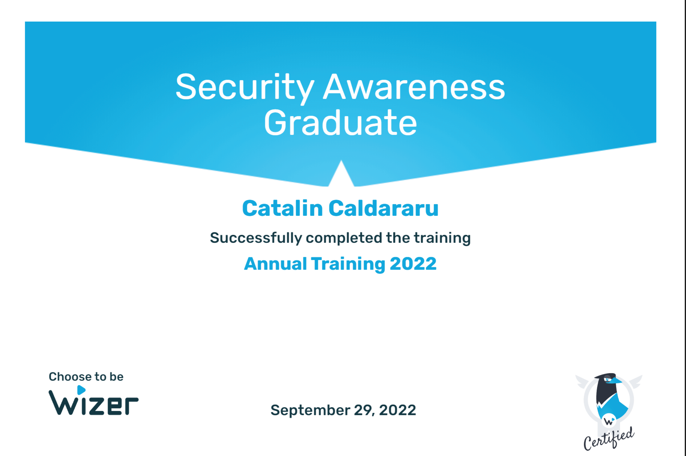

# 📚 DevOps Certifications and Achievements

Welcome! Below is a collection of my DevOps, Cloud, Linux, and Security certifications.

---

## 🏅 Certifications Gallery

<table align="center">
<tr>
<td></td>
<td></td>
<td></td>
</tr>
<tr>
<td></td>
<td></td>
<td></td>
</tr>
<tr>
<td></td>
<td></td>
<td></td>
</tr>
<tr>
<td></td>
</tr>
</table>

---

## 🛠️ Key Skills

- Ansible Automation
- CI/CD Pipelines (Jenkins, GitHub Actions)
- Containerization (Docker, Kubernetes)
- Cloud Computing (AWS, Google Cloud)
- Infrastructure as Code (Terraform, CloudFormation)
- Linux Administration and Security
- IT Security and Awareness

---

# 🚀 Next Goals

- Achieve Certified Kubernetes Administrator (CKA)
- Advance towards AWS Certified Solutions Architect
- Strengthen DevSecOps and Cloud Security skills

---

# 📫 Connect with Me

- [LinkedIn Profile](https://www.linkedin.com/in/catalin-c-02024a251/)
- [GitHub Profile](https://github.com/catalin-caldararu)

---

# 🖋️ License

This repository and its contents are licensed under the [MIT License](LICENSE).
